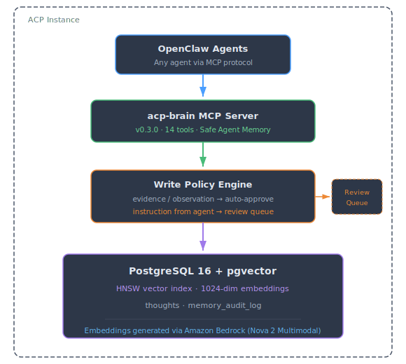

# ACP Brain — Persistent AI Memory Layer

Curated knowledge store for ACP users and agents. PostgreSQL + pgvector + Amazon Nova Embeddings, served via MCP (Model Context Protocol).

## What It Is

ACP Brain is a **curated knowledge layer** for ACP. Unlike agent workspace files (daily logs, scratchpad notes), ACP Brain stores **intentional knowledge** — decisions, architecture, people, projects, ideas — that any agent on the instance can search semantically.

**It does NOT replace agent workspace files.** Agents continue using `MEMORY.md` and `memory/YYYY-MM-DD.md` for operational state. ACP Brain is the long-term, shared knowledge store.

## Architecture

<p align="center">
  
</p>

## Tools (19)

### Core Tools

| Tool | Purpose |
|------|---------| 
| `add_thought` | Store a thought with embedding + provenance tracking |
| `search_thoughts` | Semantic vector search (excludes pending by default) |
| `list_thoughts` | Browse by type, tag, date, memory class, review status |
| `update_thought` | Edit content or metadata (re-embeds on content change) |
| `delete_thought` | Remove a thought by UUID (captures audit snapshot) |
| `get_context_for` | Aggregation — everything the brain knows about a topic |

### Safe Agent Memory (Review Queue)

| Tool | Purpose |
|------|---------| 
| `review_pending` | List thoughts awaiting human approval |
| `approve_thought` | Approve a pending thought |
| `reject_thought` | Reject with reason (kept for audit, hidden from search) |

### Audit & Observability

| Tool | Purpose |
|------|---------| 
| `audit_log` | Query full provenance trail (who/what/when) |
| `memory_stats` | Usage breakdown by class, source, status, agent |
| `get_write_policy` | View current review policy |
| `update_write_policy` | Modify policy at runtime |
| `purge_rejected` | Retention cleanup for rejected thoughts |

### Intelligence & Automation

| Tool | Purpose |
|------|---------| 
| `find_duplicates` | Find near-duplicate thoughts by content fingerprint |
| `auto_capture` | Store session summaries, action items, decisions at session end |
| `daily_digest` | Generate a summary of recent activity (configurable hours lookback) |
| `smart_add` | LLM-powered auto-classification of unstructured text into structured thoughts |
| `pan_for_gold` | Mine brain dumps and voice transcripts for actionable knowledge |

## Safe Agent Memory Contract

Every write to ACP Brain is classified:

| Memory Class | Description | Agent Write Behavior |
|-------------|-------------|---------------------| 
| `evidence` | Facts, outcomes, meeting notes | Auto-approved |
| `observation` | Inferred patterns, lower certainty | Auto-approved |
| `instruction` | Behavioral rules, preferences | **Held for review** |

Every write carries provenance:
- `write_source` — `user`, `agent`, or `system`
- `write_agent` — agent identifier (e.g. `stam-weekly-2x2`)
- Full audit trail in `memory_audit_log`

## Thought Types

| Type | Use For |
|------|---------| 
| `note` | General knowledge, observations |
| `task` | Action items, to-dos |
| `person` | People — contacts, roles, relationships |
| `project` | Projects — status, architecture, decisions |
| `idea` | Ideas for future work |
| `decision` | Architecture decisions, design choices |

## Prerequisites

- **PostgreSQL 16** with `pgvector` extension
- **Amazon Bedrock** access (Nova embeddings model)
- **Node.js 18+**
- **AWS credentials** (instance role or profile with Bedrock invoke access)

## Quick Start

```bash
# 1. Create the database
sudo -u postgres createdb openbrain
psql -d openbrain -f schema.sql

# 2. Install dependencies
npm install

# 3. Set environment
export DATABASE_URL="postgresql://localhost:5432/openbrain"
export AWS_REGION="us-west-2"
export ACP_BRAIN_DEFAULT_OWNER="your-username"

# 4. (Optional) Configure write policy
export ACP_BRAIN_TRUSTED_AGENTS="quickwork,sync-my-2x2"
export ACP_BRAIN_MAX_DAILY_WRITES=100

# 5. Start the MCP server
npm start
```

## Configuration

| Environment Variable | Default | Purpose |
|---------------------|---------|---------| 
| `DATABASE_URL` | `postgresql://localhost:5432/openbrain` | PostgreSQL connection string |
| `AWS_REGION` | `us-east-1` | AWS region for Bedrock |
| `ACP_BRAIN_DEFAULT_OWNER` | `default` | Default `source_owner` for new thoughts |
| `ACP_BRAIN_TRUSTED_AGENTS` | (empty) | Comma-separated agent names that bypass review |
| `ACP_BRAIN_MAX_DAILY_WRITES` | `100` | Max writes per agent per day |

## Agent Setup

### Amazon Quick (Desktop App)

Amazon Quick connects to ACP Brain as a custom MCP server.

**Settings → Capabilities → MCP → + Add MCP:**

| Field | Value |
|-------|-------|
| Connection type | Local (stdio) |
| ID | `acp-brain` |
| Name | `ACP Brain` |
| Command | Path to `tsx` (e.g., `/path/to/acp-brain/node_modules/.bin/tsx`) |
| Arguments | `/path/to/acp-brain/src/index.ts` |
| Timeout | 60 |

**Environment variables:**

| Key | Value |
|-----|-------|
| `ACP_BRAIN_TRANSPORT` | `stdio` |
| `DATABASE_URL` | `postgresql://localhost:5432/openbrain` |
| `AWS_REGION` | `us-east-1` |
| `ACP_BRAIN_DEFAULT_OWNER` | Your alias |

Start a new conversation after adding — all 19 tools will be available.

### Kiro (Coding Agent IDE)

Add to `~/.kiro/settings/mcp.json`:

```json
{
  "mcpServers": {
    "acp-brain": {
      "command": "/path/to/acp-brain/node_modules/.bin/tsx",
      "args": ["/path/to/acp-brain/src/index.ts"],
      "env": {
        "ACP_BRAIN_TRANSPORT": "stdio",
        "DATABASE_URL": "postgresql://localhost:5432/openbrain",
        "AWS_REGION": "us-east-1",
        "ACP_BRAIN_DEFAULT_OWNER": "your-alias"
      }
    }
  }
}
```

Restart Kiro or reconnect MCP servers from the command palette.

### OpenClaw (Agentic Compute Platform)

Add to your agent's MCP configuration:

```json
{
  "mcpServers": {
    "acp-brain": {
      "command": "/path/to/acp-brain/node_modules/.bin/tsx",
      "args": ["/path/to/acp-brain/src/index.ts"],
      "env": {
        "ACP_BRAIN_TRANSPORT": "stdio",
        "DATABASE_URL": "postgresql://localhost:5432/openbrain",
        "AWS_REGION": "us-east-1",
        "ACP_BRAIN_DEFAULT_OWNER": "your-alias"
      }
    }
  }
}
```

OpenClaw agents will automatically discover all 19 tools on connection.

## Schema

### `thoughts` table

| Column | Type | Description |
|--------|------|-------------| 
| `id` | UUID | Auto-generated primary key |
| `content` | TEXT | The thought content |
| `type` | TEXT | note, task, person, project, idea, decision |
| `title` | TEXT | Optional short title |
| `tags` | TEXT[] | Tags for categorization |
| `source_platform` | TEXT | Origin platform (openclaw, quickwork, kiro, manual) |
| `source_owner` | TEXT | User alias |
| `source_ref` | TEXT | Link to origin (URL, thread ID, etc.) |
| `confidence` | DECIMAL | Optional confidence score (0.00–1.00) |
| `metadata` | JSONB | Extensible type-specific fields |
| `embedding` | VECTOR(1024) | Amazon Nova 1024-dim embedding |
| `write_source` | TEXT | Who wrote: user, agent, system |
| `write_agent` | TEXT | Agent identifier |
| `memory_class` | TEXT | evidence, observation, instruction |
| `review_status` | TEXT | pending, approved, rejected, auto_approved |
| `reviewed_at` | TIMESTAMPTZ | When reviewed |
| `reviewed_by` | TEXT | Who reviewed |
| `created_at` | TIMESTAMPTZ | Auto-set on insert |
| `updated_at` | TIMESTAMPTZ | Auto-updated on modification |

### `memory_audit_log` table

| Column | Type | Description |
|--------|------|-------------| 
| `id` | UUID | Primary key |
| `thought_id` | UUID | Reference to thought |
| `action` | TEXT | created, updated, approved, rejected, deleted |
| `actor` | TEXT | Who performed the action |
| `actor_type` | TEXT | user, agent, system |
| `reason` | TEXT | Why (especially for rejections) |
| `snapshot` | JSONB | Thought content at time of action |
| `created_at` | TIMESTAMPTZ | When |

## Curation Model

ACP Brain uses a **Safe Agent Memory Contract**:

1. **Evidence & observations** — agents write freely (auto-approved)
2. **Instructions** — agents propose, humans approve (review queue)
3. **All writes are audited** — full provenance trail in `memory_audit_log`
4. **Rejected thoughts persist** — hidden from search but kept for audit (purge after 30 days)

This ensures agents can't self-grant behavioral rules while still allowing them to record facts autonomously.

## Inspiration & Credits

ACP Brain builds on the **Open Brain** concept pioneered by [Nate B. Jones](https://www.natebjones.com/) — a database-backed, MCP-connected personal knowledge system where any AI can query your accumulated context through a single open protocol.

**Learn more:**
- [Open Brain concept & community](https://aifor.dev/concepts/open-brain)
- [Nate's introduction post](https://natesnewsletter.substack.com/p/every-ai-you-use-forgets-you-heres) — the "why" behind persistent AI memory
- [Open Brain on GitHub (OB1)](https://github.com/NateBJones-Projects/OB1)

ACP Brain extends this foundation with Amazon Bedrock embeddings, Zulip-integrated agent workflows, a Safe Agent Memory Contract, and a curated (vs. append-only) knowledge model.

## License

MIT
